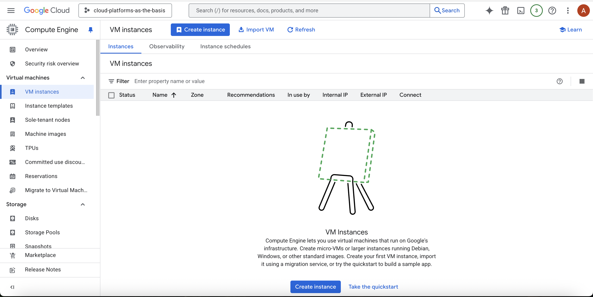

# Лабораторная работа №1

**University:** [ITMO University](https://itmo.ru/ru/)  
**Faculty:** [FICT](https://fict.itmo.ru)  
**Course:** [Introduction in Web Technologies](https://itmo-ict-faculty.github.io/introduction-in-web-tech/)  
**Year:** 2025  
**Group:** U4225  
**Author:** Корепанов Андрей    
**Lab:** Lab1   
**Date of create:** 23.11.2025  
**Date of finished:** 24.11.2025  

## Ход работы
1. Создание сервисного аккаунта

2. Создание виртуальной машины

3. Запущенная машина

4. Копирование файлов

5. Изменение прав для сервисного аккаунта

6. Копирование файлов с новыми правами

Можно сделать вывод, что Compute Viewer не имеет доступа для записи файлов на сервер

7. Удаление созданных сервисов
