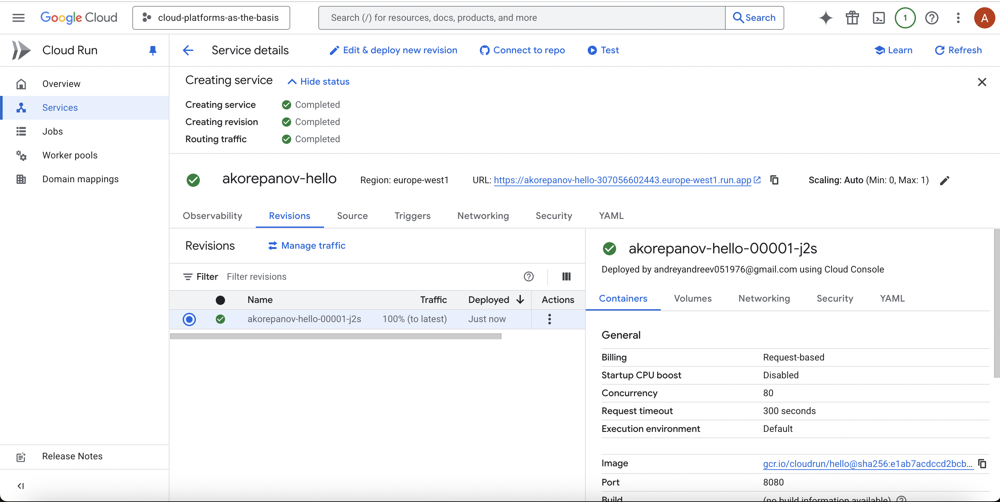

# Лабораторная работа №1

**University:** [ITMO University](https://itmo.ru/ru/)  
**Faculty:** [FICT](https://fict.itmo.ru)  
**Course:** [Introduction in Web Technologies](https://itmo-ict-faculty.github.io/introduction-in-web-tech/)  
**Year:** 2025  
**Group:** U4225  
**Author:** Корепанов Андрей    
**Lab:** Lab2   
**Date of create:** 23.11.2025  
**Date of finished:** 24.11.2025  

## Ход работы
1. Создание сервиса на основе готового образа и с минимальными настройками (128mb RAM, 1 core)

2. Рабочий сервис по ссылке

3. Анализ логов и метрик
    - Количество запросов и время ождиания ответа
    - Время ответа полного цикла и описание каждого этапа запроса 
    - количество контейнеров 
    - Потребление CPU и RAM 
    - Отправлено/Получено байт 
    - Максимальное количество параллельных запросов и время затраченное на поднятие контейнера 
    - Логи запросов 

4. Добавление новой ревизии с новым портом 8090

5. Установка новой ревизии

6. Результат по ссылке (ревизия изменилась)

7. Установка старой ревизии

8. Результат по ссылке (ревизия изменилась)

9. Удаление всех лишних сервисов
