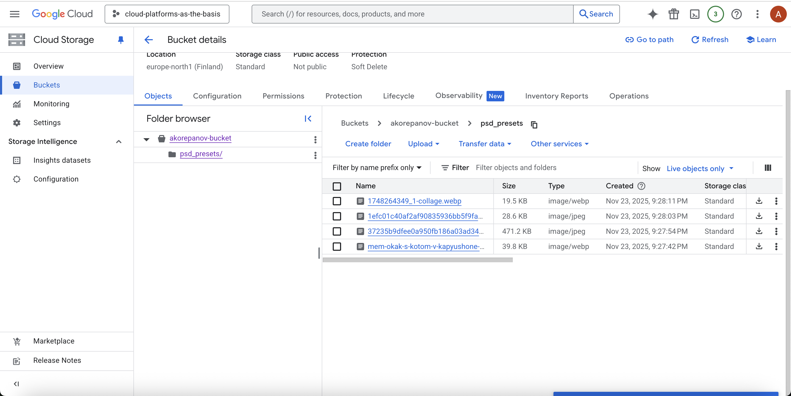

# Лабораторная работа №3

**University:** [ITMO University](https://itmo.ru/ru/)  
**Faculty:** [FICT](https://fict.itmo.ru)  
**Course:** [Introduction in Web Technologies](https://itmo-ict-faculty.github.io/introduction-in-web-tech/)  
**Year:** 2025  
**Group:** U4225  
**Author:** Корепанов Андрей    
**Lab:** Lab23  
**Date of create:** 23.11.2025  
**Date of finished:** 24.11.2025  

## Ход работы
1. Создание бакета 

2. Загрузка картинок (3-4 картинки)

3. Создание папки

4. Перенос файлов

5. Настройка публичного доступа до папки (соотвественно и файлов, так как они наследуют права от папки)

6. Получение ссылки через контекстное меню

7. Пример доступных файлов

8. Удаление сервисов (в данном случае бакета)
