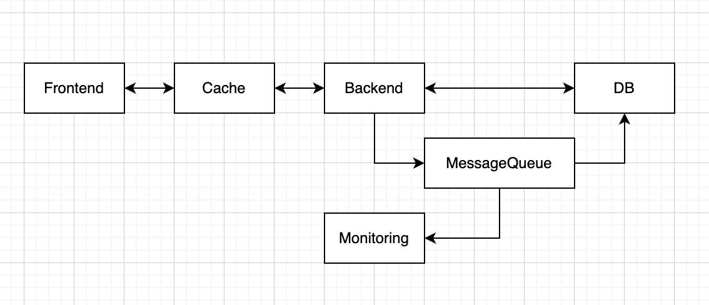
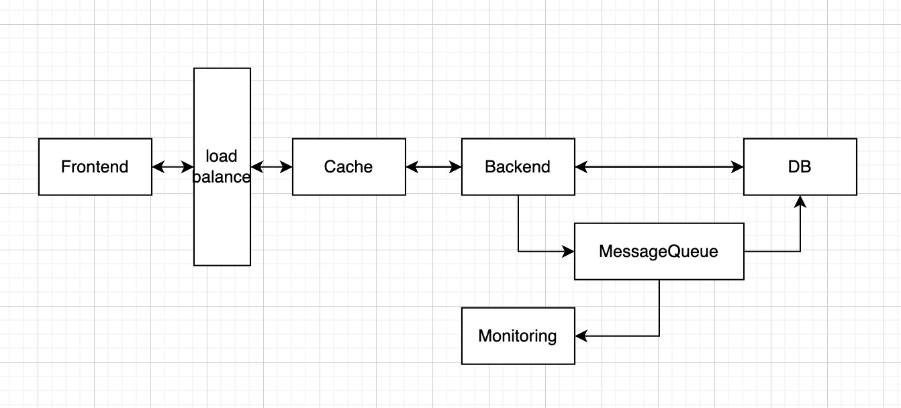
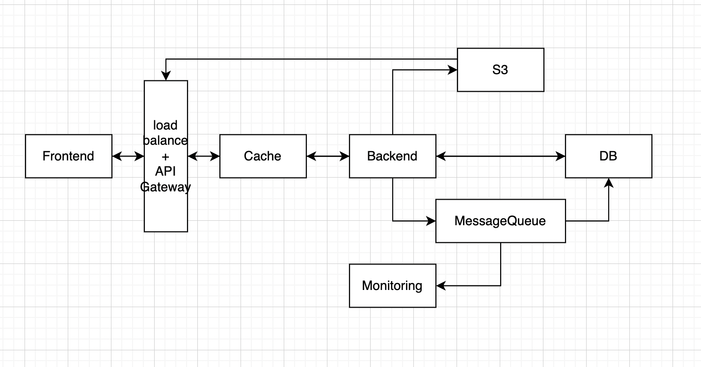

# Лабораторная работа №4

**University:** [ITMO University](https://itmo.ru/ru/)  
**Faculty:** [FICT](https://fict.itmo.ru)  
**Course:** [Introduction in Web Technologies](https://itmo-ict-faculty.github.io/introduction-in-web-tech/)  
**Year:** 2025  
**Group:** U4225  
**Author:** Корепанов Андрей    
**Lab:** Lab4  
**Date of create:** 23.11.2025  
**Date of finished:** 24.11.2025  

## Описание идеи продукта
Аналог chatgpt, только в чате могут принмать участие несколько человек, а также можно выбрать LLM модель, которая будет отвечать.

Базовый функционал:
- Совместные беседы (multi-user чаты)
- WebSocket соединения для real-time коммуникации
- Поддержка множества AI-моделей (OpenAI GPT-4, Claude, Gemini и др.)
- История сообщений
- Управление пользователями и доступами

### MVP
Предполагаемая нагрузка:
- 100-500 пользователей
- 10000 сообщений/день
- 10-50 одновременных подключений
- 100-200 AI запросов/день

Компоненты
- Frontend
- Backend
- DB (с репликами)
- Cache
- Message queue
- Monitoring

Базовая архитектура:

Расчеты:

Cloud Run (API) 1-3 инст., 1vCPU, 1GB $15-30
Cloud Run (WebSocket) 1-2 инст., 1vCPU, 512MB $10-20
Cloud SQL db-f1-micro, 10GB $25 
Memorystore Redis 1GB, Basic $35
Cloud Pub/Sub 100K сообщений $5
Cloud Storage 10GB, Standard $2 
Cloud CDN 50GB egress $5
Networking VPC, LB $10
AI API расходы 200 зап/д × $30/1M tokens $180-300 
Monitoring Базовый $5

Итог: $292-437/месяц

Обоснование выбора:
Cloud SQL дороже чем самостоятельный PostgreSQL, но экономит время DevOps
Основные расходы - AI API (60-70% бюджета)

### Тестирования партнерами
Предполагаемая нагрузка:
- 1000-5000 пользователей
- 100000 сообщений/день
- 100-500 одновременных подключений
- 1000-2000 AI запросов/день

Компоненты
- Frontend
- Backend
- DB (с репликами)
- Cache
- Message queue
- S3 storage
- Monitoring
- Load Balancer

Базовая архитектура:

Расчеты:
Cloud Run (API) 3-10 инст., 2vCPU, 2GB $100-200
GKE Autopilot (WebSocket) 2-5 подов $80-150
Cloud SQL db-custom-2-4096, 50GB $150 
Cloud SQL Read Replica1 replica $150
Memorystore Redis 5GB, Standard HA $180
Cloud Pub/Sub 2M сообщений $40
Cloud Storage 50GB $10
Cloud Load Balancer Application LB $25
Cloud Functions AI processing $50
Networking VPC, NAT $30
AI API расходы 5K зап/д × $30/1M tokens $4,500-6,000
Monitoring Расширенный $50

Итог: $5,405-7,075/месяц

Обоснование выбора:
GKE Autopilot для WebSocket - лучше масштабируется для долгих соединений
Read replica - разгружает основную БД
HA Redis - критично для production-like окружения
AI расходы растут пропорционально использованию (85-90% бюджета)

### Продовое решение

Компоненты
- Frontend
- Backend
- DB
- Cache
- Message queue
- S3 storage
- Monitoring
- CDN
- Load Balancer
- Security

Базовая архитектура:

Расчеты:
GKE Standard (API) 3-5 нод, n2-standard-4 $500-800
GKE Standard (WebSocket) 3-5 нод, n2-standard-2 $300-500
Cloud SQL db-custom-8-32768, 500GB $800
Cloud SQL Read Replicas 2-3 replicas $1,600-2,400
Memorystore Redis Cluster 50GB, HA $900
Cloud Pub/Sub 50M сообщений $400
Cloud Storage 1TB, Multi-regional $50
Cloud CDN 5TB egress $350
Cloud Load Balancer Global LB $50
GKE (AI Processing) 3-10 нод $400-1,000
Cloud ArmorWAF + DDoS $100
Apigee/EndpointsAPI Management $200
Networking VPC, NAT, VPN $100
AI API расходы 100K зап/д × $30/1M tokens $90,000-120,000
Monitoring & Logs Enterprise $300
Backups & DR $200

Итог: $96,250-127,850/месяц (Большая часть расходов - AI API)

Обоснование выбора:
GKE Standard вместо Cloud Run/Autopilot - полный контроль, оптимизация
Множественные read replicas - horizontal scaling для чтения
Redis Cluster - распределенный кэш
Cloud Armor - защита от DDoS и злоупотреблений
AI расходы доминируют (93-95% бюджета)